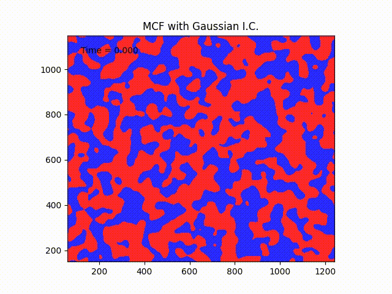
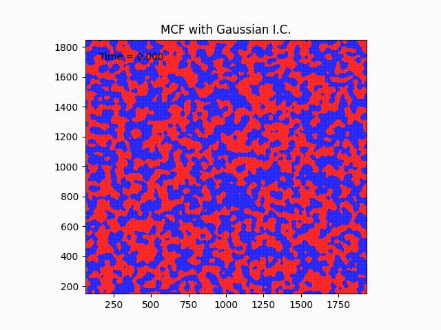

# Random-Allen-Cahn

In a work in progress we study the long-time behaviour of the Allen-Cahn equation started in a random initial condition.

If the initial condition is an approximation of space white noise, the longtime behaviour of the equation is governed by the mean curvature flow evolution of nodal sets of a Gaussian field with Gaussian covariance.

The simulations show such mean curvature flow evolution, following a simple algorithm explained by Evans ("Convergence of an algorithm for mean curvature motion", https://www.jstor.org/stable/24897106).

